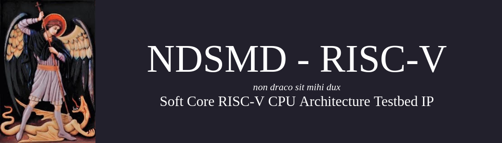

#

NDSMD is a RISC-V soft core processor IP designed to be an extensible demonstration platform for advanced architecture techniques, including, but not limited to, multilevel cache hierarchy, branch prediction, support for M, A, and F extensions, and out-of-order execution. This is a redesign of a previous project I worked on, with more rigorous verification and an emphasis on robustness to change.

## Development Plan

The current development plan is as follows:
- [ ] Develop basic version of RV32I for use with BRAM ROM and RAM.
- [ ] Develop multilevel cache heirarchy with AXI-based L1iCache, L1dCache, L2uCache, with a master controller for testing.
- [ ] Develop branch prediction mechanism in basic BRAM ROM/RAM RV32I demonstration.
- [ ] Develop FPU with master controller and BRAM RAM interface to demonstrate processing of floating point instructions.
- [ ] Develop Tomasulo-based OOO architecture leveraging developed RV32I demo and new FPU.

## Target Platform

This project is designed to target AMD-Xilinx FPGAs, so initial development will target the Arty A7. In the event that the Arty A7 becomes too small for the full implementation of the processor, the Genesys 2 will likely be the successor platform. However, that does not mean Arty A7 support will be dropped; it means that certain features will be tied to generics at instantiation. Of course, this means performance will be lowered as more features are removed.